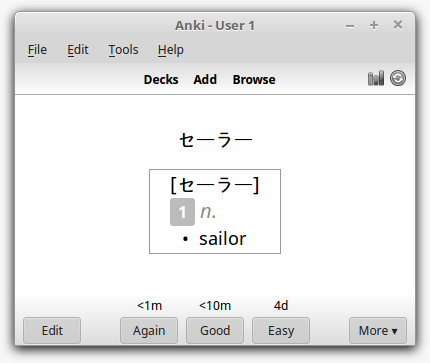

# Srt2Vocab
###### Converts subtitles into Anki decks

### What it is

This converts subtitle (srt) files into Anki decks.  It's different than subs2srs, because this splits voice lines into words similar to how [Jisho does it](https://jisho.org/search/%E3%81%8A%E5%89%8D%E3%81%AF%E3%82%82%E3%81%86%E6%AD%BB%E3%82%93%E3%81%A7%E3%81%84%E3%82%8B) and shows you the most common words first.  So you can use this deck to understand an anime without spoiler voice lines.

### What it does for you

The most common words show up first, so you'll see the common essentials to understand sentence structure first, then vocab specific to the anime.  I filtered out single-character particles like は and の to get there faster.  You'd be surprised at how quickly you see some specific words (セーラー is the 14th word in the Sailor Moon deck, which, fun fact, is said 1490 times).  But again, there will be stuff to skim through at the beginning of decks.

### What not to expect

 * **Minimalist definitions.** This uses JMDict data (same as Jisho) and that doesn't include which definitions are most important (or even the general frequency of a word, unfortunately).  If you're used to Jisho then this is just like it, though.
 * **Using every card of the deck.** I mean you can (the definitions don't ever start being wrong), but eventually frequency becomes scarce and it might be better to look up when you see the word instead.  It seems ~75% of the words from Sailor Moon pop up at least twice, though.
 * **Bug-free software.** The deck might have a little mess; importing seems to show a few duplicate words (for sailor moon, less than 1 in 1000 -- some may be genuine homophones).  Over time I may fix these bugs.

### Usage

 * Download the [latest release](https://github.com/pimlu/srt2vocab/releases).
 * Acquire Japanese subtitle files.
 * `java -jar srt2vocab.jar --srt output_deck.tsv input_subtitle_*.srt`
 * Open the [placeholder apkg](https://github.com/pimlu/srt2vocab/raw/res/Srt2Vocab.apkg) which contains the HTML/CSS for the cards.
 * Import `output_deck.tsv` into the empty deck you just created.  Make sure to allow HTML.

### Building from source

This is a Maven project which should download its dependencies when you attempt to build.  I didn't want to commit >15MB of CSVs to the repo so that's missing.  I'll publish that soon along with the jar.

### Bug reports

Feel free to [file issues](https://github.com/pimlu/srt2vocab/issues).
